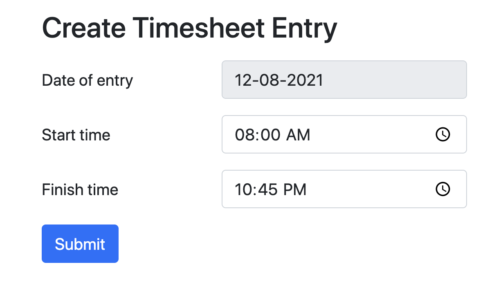

# my-time-tracker
Time sheet entry tracking




### Prerequisites
- Ruby 2.6.8
- Postgres ~> 9.6
- NodeJS ~> 14.17.3
- Yarn ~> 1.22.10
- Bundler ~> 2.2.25

### Dependencies installation
```
bundle install
yarn install
```

### Database initialization & Seeding
```
rails db:create
rails db:migrate
rails db:seed
```

### How to run the test suite
```
rspec
```

### How to start server
```
rails s
```

### Demo
heroku: https://desolate-stream-54002.herokuapp.com/

aws: http://18.188.214.43/

